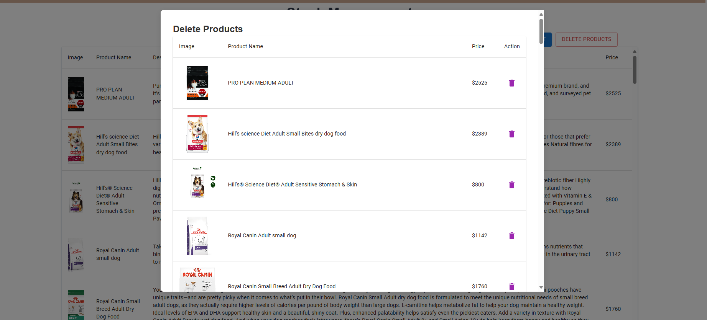

# Project 2 Description
Link: https://project-2-lovat.vercel.app/

# Overview
> In this project, I'm working on the "Pet goods online store" which focusing on selling pet goods for customer and this application having a stock manager function for store owner which convience them to add and delete the product on the platform realtime. So, This web application developed in NextJS framework for frontend development and MongoDB as backend services. For additional styling library i using EmblaCarosel to decorate the homepage to displaying store art work for advertisment. Moreover, More than half of the element in this project i use mui library for styling my web application design such as Icon, Modal, Breadcrumbs,etc. Also, I added the react toastify library to alert when user grab some stuff in the cart. For the attached elements i have Top, header, Navbar with dropdown item and Footer which attact to all pages.

# Features
> This web application have 4 main features which are add to cart function, retriving the data from the form, displaying the product from mongodb collection and stock management function incluced real-time add and delete item to the database.
>
> 1. Add to cart function
>      --> This function will store the items in the cart globally which mean if you switching the page, items will still in cart until you proceed the payment.
>
> 2. Form
>      --> We can retriving the data in the form and store to database when user follow through the process and trigger the button so, The information will PUSH to database automatically.
>
> 3. Display the product from database
>
>     --> In the product page shown the products data that GET from the database and it will update along with updated database.
>
> 4. Stock management
>
>     --> This is feature allow store owner to add more products to the shop and summarize the added product such as product name, product image, product price or even product description before user press confirm. On the other hand, it have delete function to remove the product from the database by click the trash icon when the at the right side of the product list table on delete modal pop up.

# Screenshot
### Homepage

### Store page

### Stock management page

>Add product

>Delete product

### Add to cart alert

### Cart

